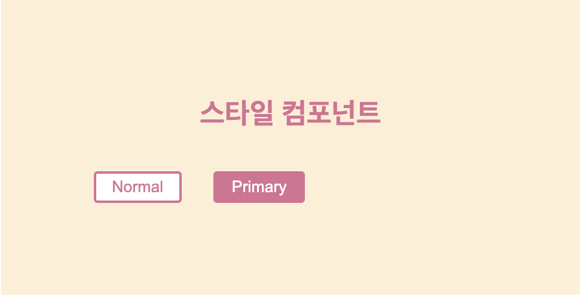

# styled-components

# install
```
yarn add vue-styled-components
```

# Basic
```vue
<template>
  <Wrapper>
    <StyleTitle>
      스타일 컴포넌트
    </StyleTitle>
  </Wrapper>
  <!--  아래와 같이 카멜 표기법이 아닌 케밥표기법으로 컴포너트를 적어도 적용이 된다.-->
  <!--  <wrapper>-->
  <!--    <styled-title>스타일 컴포넌트</styled-title>-->

  <!--  </wrapper>-->
</template>

<script>
import styled from 'vue-styled-components';

const StyledTitle = styled.h1`
  font-size: 1.5em;
  text-align:center;
  color:palevioletred;
`;

const Wrapper = styled.section`
  padding:4em;
  background:papayawhip;
`


export default {
  name: 'compCard',
  components:{
    Wrapper,
    StyledTitle,
  }
};
</script>


```

# export로 내보내기 가능.
- style.js
```jsx
import styled from 'vue-styled-components';

export const StyledTitle = styled.h1`
  font-size: 1.5em;
  text-align:center;
  color:palevioletred;
`;

export const Wrapper = styled.section`
  padding:4em;
  background:papayawhip;
`


```
- vue
```vue
<template>
  <Wrapper>
    <StyledTitle>
      스타일 컴포넌트
    </StyledTitle>
  </Wrapper>
</template>

<script>
import {Wrapper, StyledTitle} from './style';

export default {
  name: 'compCard',
  components:{
    Wrapper,
    StyledTitle,
  }
};
</script>

```

## props를 통해 조건부 스타일링 가능.
```vue
<template>
  <Wrapper>
    <StyledTitle>
      스타일 컴포넌트
    </StyledTitle>
    <styled-button>Normal</styled-button>
    <!-- 아래 컴포넌트에는 primary 속성을 지정해 true값으로 설정할 수 있다.-->
    <styled-button primary>Primary</styled-button>

  </Wrapper>
</template>

<script>
import styled from "vue-styled-components";
import {Wrapper, StyledTitle} from './style';
//primary를 불리언 값으로 지정한 뒤 true 일때는 메인 스타일, false일 때는 다른 스타일로 지정해줄 수 있다.
const btnProps = {primary : Boolean};

const StyledButton = styled('button', btnProps)`
  ont-size: 1em;
  margin: 1em;
  padding: 0.25em 1em;
  border: 2px solid palevioletred;
  border-radius: 3px;
  background:${props => props.primary ? 'palevioletred' : 'white'};
  color: ${props => props.primary ? 'white' : 'palevioletred'};
`

export default {
  name: 'compCard',
  components:{
    Wrapper,
    StyledTitle,
    StyledButton
  },
  props:{
    propA : String,
    propB : [String, Number]
  }
};
</script>

```
<p align="center"></p>

- as 속성으로 태그의 종류를 바꿀 수 있다.
